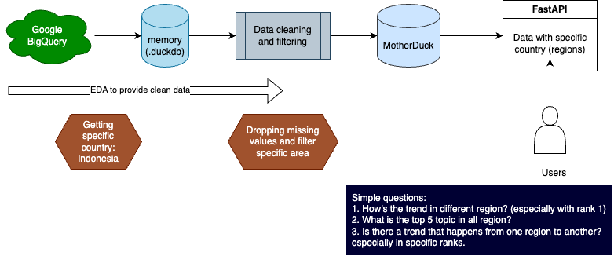

<h1 align="center">Hacktoberfest 2023 project!</h1>

<h1 align="center">Magicalytics</h1>
This is a solo project to get to know about available open-source resources which can be used to initiate data science project. The result will be a dashboard with features to help analyzing the data.

---
## 📕 Theme 
Extract Transform Load (ETL) pipeline with analytics components.

## 📝 Description
The aim for this magicalytics is to provide insights from trend data (generated by Google Analytics) and able to provide interaction between the data and AI. For this initial test, I use Google data trend that is obtained from BigQuery.

The example data is obtained from Google BigQuery and the link can be found [here](https://console.cloud.google.com/marketplace/product/bigquery-public-datasets/google-search-trends).

The tools which will be used are:
- Poetry
- JupySQL 
- Google BigQuery API
- Voila
- Ploomber
- will add more later....

*The outcome of this project is an analytical dashboard which can be used to process Google Analytics result and communicate with Retrieval Augmented Generation (RAG) pipeline.*

[//]: # (- Provide a description of your project. Include the data sources you are using, the tools you are using, and the expected outcome of your project.)

## 💾 Data sources 

For this project, I use data from Google Analytics data which are tabulated in BigQuery.
However, you may be able to use both single .csv file or any type of database.

## 🖥️ Methods

The methods that I use is shown in the figure below.

Workflow figure cover the ETL diagram (1-5) and the next points will be added later.

1. The workflow starts from environment preparation (Conda, Poetry, APIs, etc.).
2. Downloading the data by querying necessary tables from Google BigQuery via API.
3. Splitting the data into different tables based on ranking and deposited as .duckdb database.
4. Building the Exploratory Data Analysis (EDA) pipeline.
5. Pushing the clean data to the database for making processing ready data.
6. Making _unique_ analysis using NLP algorithm and other machine learning algorithms.
7. Adding RAG feature to bridge the communication between users and analyzed data.
8. Building dashboard for whole visualization and data summary.
9. Deployment via Ploomber.

## 📊 User interface
The interface would be a Voila dashboard that host default data from the sample data mentioned above.
The dashboard can also host uploaded data. However, uploaded data will need to be selected first, since the dashboard requires .....

Figure dashboard here later...

[//]: # (Describe the user interface your project will have. Include a description of the tools you are using.)

## 🙋🏻‍♂️ Team members
This is solo project, so, I am the only one who is working on it! 😮‍💨 \
Feel free to visit my site as well https://www.sanka.studio